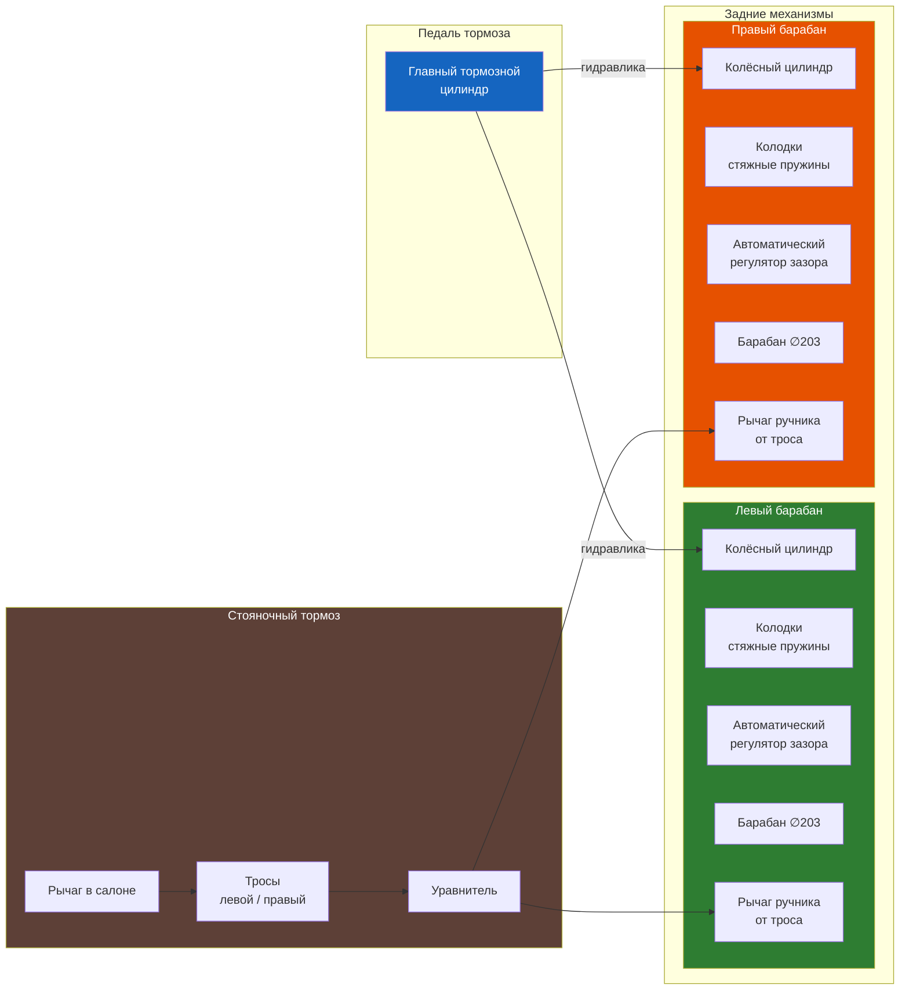

# 7.2 Задние тормозные механизмы

Задние тормоза Renault Symbol — барабанного типа с автоматическим регулятором зазора. Привод осуществляется от главного тормозного цилиндра (гидравлический) и от рычага стояночного тормоза (механический, через трос).

## Технические характеристики

| Параметр | Значение |
|----------|----------|
| Внутренний диаметр барабана (новый) | 203 мм |
| Предельно допустимый диаметр (износ) | 205,5 мм |
| Максимальная овальность (разность диаметров) | 0,05 мм |
| Толщина новой накладки колодки | 4,6–5,0 мм |
| Минимальная толщина накладки | 1,5 мм |
| Диаметр колёсного цилиндра | 17,46 мм (11/16″) |
| Момент затяжки направляющего штифта колодок | 10 Н·м |
| Момент затяжки болта колёсного цилиндра | 8–10 Н·м |
| Момент затяжки колесных болтов | 90–105 Н·м |
| Ход рычага стояночного тормоза | 5–7 щелчков |

## Замена задних тормозных колодок

1. Поднимите заднюю часть автомобиля, снимите колесо.

2. Отверните направляющие штифты барабана (Torx T30), снимите барабан.

   ⚠ Если барабан не снимается — проверните центральную распорную планку регулятора через отверстие в опорном щите (отвёрткой). Ослабьте натяг колодок.

3. Отожмите верхнюю пружину колодок (специальным крючком или пассатижами с узкими губками). Снимите пружину.

4. Разведите колодки в стороны и снимите с опорного щита. Освободите нижнюю стяжную пружину.

5. Отсоедините трос стояночного тормоза от рычага на задней колодке (снимите пружинный фиксатор).

6. Снимите регулятор зазора (распорную планку с храповым механизмом). Запомните его ориентацию.

7. Снимите переднюю (меньшую) и заднюю (большую) колодки в сборе с рычагом.

8. Смажьте точки контакта колодок с опорным щитом (консистентная смазка, термостойкая).

9. Установите регулятор зазора. Вверните его до минимума, затем разверните на 3–4 оборота — предварительная настройка.

10. Установите колодки. Подсоедините трос ручника к рычагу, зафиксируйте.

11. Установите нижнюю стяжную пружину. Разведите колодки, установите верхнюю пружину.

12. Установите барабан. Если барабан не надевается — отрегулируйте регулятор (уменьшите зазор).

13. Несколько раз нажмите на педаль тормоза — регулятор автоматически выставит зазор.

14. Установите колесо, опустите автомобиль.

## Проверка и замена колёсного цилиндра

Признаки неисправности колёсного цилиндра:

- Течь тормозной жидкости на внутренней стороне барабана
- Закисание поршней (колодки не возвращаются)
- Повреждение пыльника

### Замена колёсного цилиндра

1. Снимите барабан и колодки (шаги 1–6).

2. Отсоедините тормозную трубку от цилиндра (ключ на 10 мм).

3. Отверните два болта крепления цилиндра к опорному щиту (Torx T30).

4. Установите новый цилиндр, затяните болты моментом 8–10 Н·м.

5. Подсоедините трубку, затяните штуцер моментом 12–15 Н·м.

6. Установите колодки, барабан, прокачайте контур (удалите воздух).

## Регулировка стояночного тормоза

1. Поднимите задние колёса домкратом, установите опоры.

2. В салоне снимите центральную консоль вокруг рычага ручника (или кожух).

3. Натяните трос регулировочной гайкой под рычагом.

4. Контрольные точки:
   - При затяжке на 2–3 щелчка колодки должны прижиматься к барабанам
   - Полный ход — 5–7 щелчков
   - Автомобиль не должен катиться на уклоне 18 % при затянутом ручнике

5. ⚠ Перетяжка ручника приводит к постоянному притиранию колодок и перегреву барабанов.

## Проверка автоматического регулятора зазора

| Признак | Действие |
|---------|----------|
| Увеличенный ход педали тормоза (при нормальном уровне жидкости) | Регулятор не выбирает зазор — замена |
| Неравномерный износ колодок (одна стёрта, другая нет) | Регулятор заклинен с одной стороны |
| Барабан греется после отпускания педали | Регулятор перетянут — разборка и чистка |

## Типовые неисправности задних тормозов

| Проблема | Причина | Решение |
|----------|---------|---------|
| Скрежет при торможении | Накладки изношены до металла | Немедленная замена колодок, проверка барабана |
| Машину заносит при торможении | Неравномерная работа задних тормозов, закисание цилиндра | Проверка цилиндров и регулятора |
| Педаль «проваливается» | Утечка из колёсного цилиндра, воздух в контуре | Замена цилиндра, прокачка |
| Стук в заднем колесе при движении | Ослабление барабана или колодок | Подтяжка, замена пружин |
| Не держит ручник | Ослабление троса, износ колодок, замасливание накладок | Регулировка, замена колодок |
