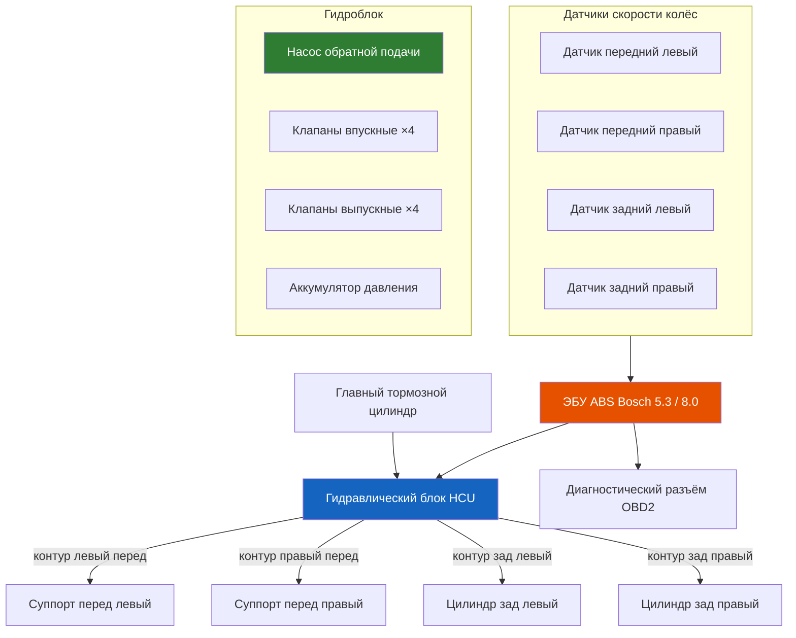

# 7.3 Антиблокировочная система (ABS)

Антиблокировочная система предотвращает блокировку колёс при экстренном торможении, сохраняя управляемость и курсовую устойчивость. На Renault Symbol ABS устанавливалась опционально с 2001 года. Применялись блоки Bosch 5.3 **[Symbol I / ранний Symbol II]** и Bosch 8.0 **[Symbol II с 2005 / Symbol III]**.

## Компоненты системы

### Гидравлический блок (HCU — Hydraulic Control Unit)

Объединяет насос обратной подачи, электромагнитные клапаны (впускные/выпускные на каждое колесо) и аккумулятор давления. ЭБУ встроен в корпус гидроблока в неразборном исполнении.

| Узел | Функция |
|------|---------|
| Насос обратной подачи | Возвращает жидкость из контура колеса в ГТЦ при сбросе давления |
| Электромагнитные клапаны | Управляют давлением в каждом контуре: удержание / сброс / набор |
| Аккумулятор давления | Демпфирует пульсации при работе насоса |
| ЭБУ | Обрабатывает сигналы датчиков, управляет клапанами и насосом |

### Датчики скорости колёс

- **Передние:** индуктивные (пассивные), установлены в поворотном кулаке, считывают зубья на наружном ШРУСе привода
- **Задние:** индуктивные, установлены в ступице, считывают зубья на обойме подшипника
- **Зазор датчик–ротор:** 0,3–1,2 мм (регулируется прокладками)

### Предохранители

| Цепь | Предохранитель | Расположение |
|------|----------------|--------------|
| ЭБУ ABS (питание) | 30 А (F14) | Монтажный блок под капотом |
| Насос ABS | 40 А (F03) | Монтажный блок под капотом |
| Диагностический разъём | 10 А (F07) | Монтажный блок в салоне |

## Диагностика ABS

### Контрольная лампа ABS

- **Загорается при включении зажигания** — самодиагностика (2–3 секунды), затем гаснет — норма
- **Горит постоянно после пуска** — неисправность, система отключена (тормоза работают как обычные)
- **Загорается в движении** — периодическая неисправность (обрыв проводки, загрязнение датчика)
- **Не загорается вообще** — перегорела лампа или неисправность цепи панели приборов

### Считывание кодов неисправностей

1. Подключите диагностический сканер (Renault Can Clip, ELM327 с совместимым ПО, Launch X431) к разъёму OBD2.

2. Войдите в блок управления ABS.

3. Считайте коды:

| Код Bosch | Описание |
|-----------|----------|
| C0010 | Датчик скорости переднего левого колеса |
| C0015 | Датчик скорости переднего правого колеса |
| C0020 | Датчик скорости заднего левого колеса |
| C0025 | Датчик скорости заднего правого колеса |
| C0035 | Цепь датчика переднего левого (обрыв/КЗ) |
| C0040 | Цепь датчика переднего правого |
| C0045 | Цепь датчика заднего левого |
| C0050 | Цепь датчика заднего правого |
| C0060 | Гидравлический блок (клапан/насос) |
| C0070 | Реле насоса ABS |
| C0080 | Напряжение питания ниже 9 В или выше 16 В |

### Проверка датчика ABS (мультиметром)

1. Отсоедините разъём датчика на стойке амортизатора.

2. Измерьте сопротивление между выводами:
   - **Норма:** 700–2500 Ом (зависит от температуры)
   - **Обрыв:** бесконечность — замена датчика
   - **Короткое замыкание:** 0 Ом — замена датчика

3. Проверьте изоляцию на массу: сопротивление между любым выводом и «массой» — более 1 МОм.

## Прокачка тормозной системы с ABS

⚠ Стандартная прокачка педалью (качками) **неэффективна для ABS** — воздух может оставаться в гидроблоке. Используйте метод CLIP или прокачку под давлением.

### Прокачка сканером (CLIP-метод)

1. Подключите сканер, войдите в меню ABS → «Прокачка тормозов».

2. Долейте жидкость в бачок ГТЦ до MAX.

3. Следуйте инструкциям сканера — система поочерёдно открывает клапаны каждого контура и запускает насос.

4. Одновременно откройте штуцер прокачки на соответствующем колесе — выходит старая жидкость с воздухом.

5. Повторите, пока не пойдёт чистая жидкость без пузырьков. Последовательность: заднее правое → заднее левое → переднее правое → переднее левое.

### Прокачка без сканера (только при исправной ABS)

Если сканер недоступен, используйте прокачку под давлением (1,0–1,5 бар):

1. Подсоедините устройство прокачки (например, Gunson Eezibleed) к бачку ГТЦ.

2. Создайте давление 1,0–1,5 бар в системе.

3. Прокачайте контуры в порядке: заднее правое → заднее левое → переднее правое → переднее левое.

4. Завершите циклом активации ABS (разгон до 30–40 км/ч и резкое торможение на ровном сухом покрытии). Повторите прокачку.

## Типовые неисправности ABS

| Проблема | Причина | Решение |
|----------|---------|---------|
| Лампа ABS горит, код датчика | Грязь на датчике, обрыв провода, износ ротора | Очистка, проверка цепи, замена датчика |
| Лампа ABS горит, код гидроблока | Неисправность клапана/насоса (обычно — необратима) | Замена гидроблока в сборе |
| ABS срабатывает на сухом асфальте | Неравномерный зазор датчика, дефект ротора | Проверка зазора, замена ротора/датчика |
| ABS не срабатывает (колёса блокируются) | Предохранитель, реле насоса | Проверка цепи питания |
| Насос ABS гудит дольше 3–5 секунд | Воздух в гидроблоке после прокачки | Повторная прокачка сканером |
| Лампы ABS + ручника горят одновременно | Пониженное напряжение (АКБ разряжена) | Зарядка/замена АКБ |

⚠ **При замене гидроблока ABS** необходима адаптация (инициализация) через CLIP. Новый блок должен быть запрограммирован под VIN автомобиля. Б/у блоки с другого автомобиля не работают корректно.

⚠ **Запрещается** отсоединять разъём ABS при включённом зажигании — это может повредить ЭБУ.

⚠ **При сварке кузова** отсоединяйте разъём ЭБУ ABS. Импульсные токи сварки выводят блок из строя.
