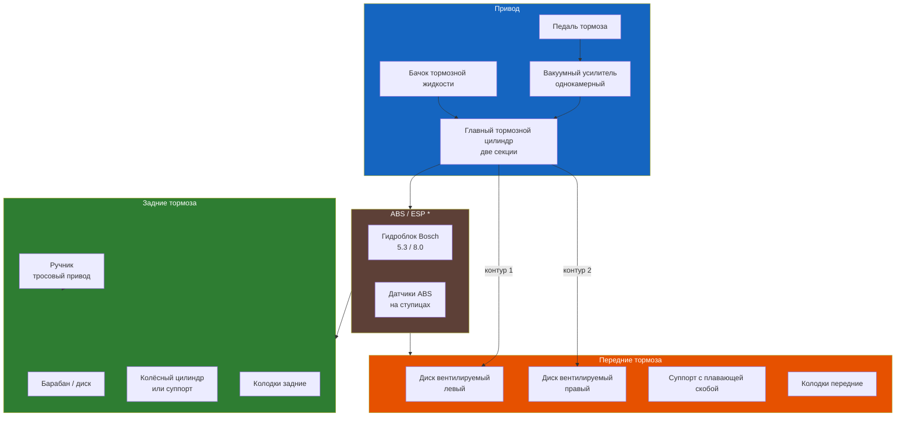

# Тормозная система

Раздел содержит описание тормозной системы Renault Symbol — от гидравлического привода до исполнительных механизмов всех колёс.

## Общая характеристика

На Renault Symbol применяется гидравлическая тормозная система с диагональным разделением контуров (переднее левое — заднее правое, переднее правое — заднее левое). Это обеспечивает сохранение тормозного усилия при выходе из строя одного из контуров.

| Параметр | Значение |
|----------|----------|
| Тип передних тормозов | Дисковые, вентилируемые, с плавающей скобой |
| Тип задних тормозов | Барабанные (на части рынков — дисковые) |
| Привод | Гидравлический, два независимых контура |
| Усилитель | Вакуумный, однокамерный |
| Тормозная жидкость | DOT4 (ELF 650 D.O.T.4 или аналог) |
| Объём гидропривода | ~0,5 л (с прокачкой) |
| ABS | Опционально, Bosch 5.3 (с 2001 г.) или Bosch 8.0 (с 2005 г.) |

## Структура раздела

- **7.1** — Передние тормоза (диски, колодки, суппорт — замена и обслуживание)
- **7.2** — Задние тормоза (барабан, колодки, колёсный цилиндр, ручник)
- **7.3** — Антиблокировочная система ABS (диагностика, ремонт, прокачка)

## Меры безопасности

⚠ **Тормозная жидкость гигроскопична.** Впитывает влагу из воздуха, снижая температуру кипения. Замена — каждые 2 года независимо от пробега.

⚠ **Тормозная жидкость агрессивна к лакокрасочному покрытию.** При попадании на кузов немедленно смойте водой.

⚠ **Не используйте DOT5** (силиконовую) — она несовместима с уплотнениями системы, рассчитанными на DOT4.

⚠ **При замене колодок обязательно** вдавливайте поршень в суппорт — иначе новые колодки не установятся. Перед вдавливанием откачайте избыток жидкости из бачка ГТЦ.

⚠ **После любого вмешательства в гидропривод** удалите воздух (прокачайте систему). Педаль должна быть «твёрдой» — без провалов и мягкости.

## Регулятор тормозных сил (корректор)

На автомобилях без ABS устанавливается механический регулятор тормозных сил («колдун»), расположенный на задней балке. Он дозирует давление в задних тормозах в зависимости от загрузки автомобиля.

| Признак неисправности | Причина |
|------------------------|---------|
| Задние колёса блокируются раньше передних | Ослабление или закисание привода регулятора |
| Недостаточная эффективность задних тормозов | Регулятор не открывается полностью |
| Увод автомобиля при торможении | Неравномерная работа левого/правого контура |

## Периодичность обслуживания

| Работа | Периодичность |
|--------|---------------|
| Проверка толщины колодок | Каждые 15 000 км |
| Проверка толщины тормозных дисков | Каждые 30 000 км |
| Проверка состояния барабанов и колодок | Каждые 30 000 км |
| Замена тормозной жидкости | Каждые 2 года |
| Проверка и регулировка ручника | Каждые 15 000 км |
| Диагностика ABS (при наличии) | При загорании лампы ABS |

## Типовые неисправности тормозной системы

| Симптом | Вероятная причина |
|---------|-------------------|
| Мягкая педаль («проваливается») | Воздух в системе, течь жидкости |
| Твёрдая педаль при малом замедлении | Закисание поршня суппорта, износ колодок |
| Вибрация педали/руля при торможении | Деформация тормозных дисков |
| Скрип/свист | Износ колодок, отсутствие смазки направляющих |
| Увод в сторону при торможении | Закисание суппорта, неравномерный износ колодок |
| Стук при торможении | Люфт направляющих суппорта |
| Горит лампа ABS | Неисправность датчика, гидроблока или цепи |

## Инструмент для обслуживания тормозов

- Набор ключей (рожковые и торцовые) 8–19 мм
- Динамометрический ключ 5–150 Н·м
- Съёмник тормозных дисков (при коррозии)
- Приспособление для вдавливания поршня суппорта
- Ключ для тормозных штуцеров прокачки (8 мм)
- Прозрачный шланг + ёмкость для прокачки
- Тестер DOT4 (для проверки температуры кипения)
- Смазка для направляющих суппорта (высокотемпературная, медная или силиконовая)
- Домкрат, страховочные опоры, баллонный ключ
