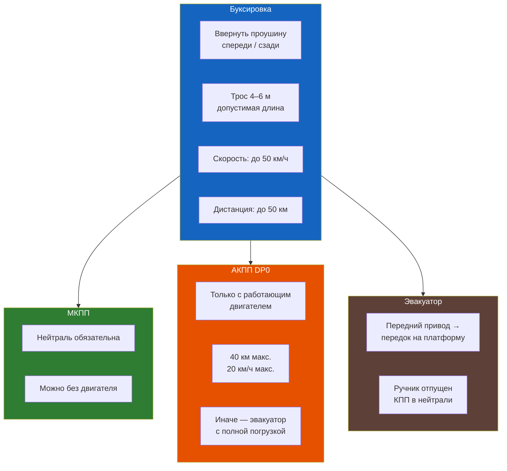

# Эвакуация и буксировка



## Буксирные проушины

### Передняя

- **Расположение:** справа под передним бампером, закрыта пластиковой заглушкой
- **Конструкция:** съёмная стальная проушина, вворачивается в резьбовое отверстие лонжерона
- **Ключ:** 19 мм (или Torx T50 на некоторых версиях)
- **Момент затяжки:** 35–40 Н·м

```admonition warning
Запрещается буксировать автомобиль за рычаги подвески, рулевые тяги или амортизаторы.
Буксировка за непредназначенные для этого элементы приводит к повреждению ходовой части.
```

### Задняя

- **Расположение:** справа под задним бампером, закрыта заглушкой
- **Конструкция:** съёмная, вворачивается в лонжерон
- **Ключ:** 19 мм

### Установка проушины

1. Откройте крышку буксирного отверстия (поддеть тонкой отвёрткой)
2. Вверните проушину рукой до упора
3. Дотяните ключом (не перетяните — резьба в кузове)
4. После использования выверните и верните заглушку на место

## Буксировка жёсткой сцепкой

Рекомендуемый способ для Symbol — **жёсткая сцепка** (штанга). Обеспечивает равномерное распределение нагрузки и безопасность при движении.

### Требования

| Параметр | Допустимое значение |
|----------|-------------------|
| Длина сцепки | Не более 4 м |
| Скорость | Не более 50 км/ч |
| Дистанция между автомобилями | 4–6 м (при жёсткой сцепке 1,5–2 м) |
| Буксирующий автомобиль | Масса не менее массы Symbol (~1000 кг) |

```text
При буксировке:
1. Водитель буксируемого авто должен следить за натяжением троса/штанги
2. Рывки недопустимы — используйте плавное натяжение
3. Тормозить буксируемый автомобиль должен одновременно с буксирующим
4. Двигатель буксируемого авто должен работать (для работы ГУР и вакуумного усилителя тормозов)
```

## Буксировка мягкой сцепкой (трос)

### Требования к тросу

| Параметр | Значение |
|----------|----------|
| Минимальная длина | 4 м |
| Максимальная длина | 6 м |
| Разрывная нагрузка | Не менее 2500 кг |
| Цвет | Должен иметь флажки или светоотражатели |

### Порядок действий

1. Закрепите трос только за буксирные проушины
2. Включите аварийную сигнализацию на обоих автомобилях
3. Перед началом движения натяните трос плавно, без рывка
4. Двигайтесь со скоростью не более 50 км/ч
5. Избегайте резких поворотов — трос может лопнуть или задеть колесо
6. При остановке не натягивайте трос (дайте слабину), чтобы он не попал под колёса

### Запрещается при буксировке на тросу

- Резко трогаться с места (трос рвётся или повреждается кузов)
- Буксировать с выключенным зажиганием (заблокируется руль)
- Буксировать автомобиль с неработающим двигателем дольше 50 км
- Использовать трос с повреждениями (надрывы, узлы, коррозия)

## Особенности для разных типов КПП

### Механическая КПП (JB3 / JC5)

| Условие | Режим |
|---------|-------|
| Двигатель работает | Нейтраль (N), любая скорость не более 50 км/ч |
| Двигатель не работает | **Запрещено** буксировать более 50 км — нет смазки КПП |
| Пуск «с толкача» | **Разрешён** на II–III передаче, сцепление выжато. Накат до 20 км/ч → отпустить сцепление |

### Автоматическая КПП (DP0 / AL4)

| Условие | Режим |
|---------|-------|
| Двигатель работает | P или N, скорость не более 50 км/ч |
| Двигатель не работает | **Запрещено** — масляный насос АКПП не работает, нет смазки. Максимум 20 км на 20 км/ч |
| Пуск с толкача | **Невозможен** (гидротрансформатор не передаёт момент без давления масла) |

```admonition danger
Буксировка автомобиля с АКПП на тросу при неработающем двигателе **разрушает коробку за 5–10 км.** Масляный насос АКПП работает только при работающем двигателе. Без смазки фрикционы сгорают.
```

## Эвакуация

### Когда вызывать эвакуатор

| Ситуация | Действие |
|----------|----------|
| Двигатель не заводится (АКПП) | Эвакуатор с полной погрузкой |
| Повреждена подвеска или колесо | Эвакуатор с полной погрузкой |
| Двигатель не заводится (МКПП) | Допустима буксировка до 50 км |
| Перегрев двигателя | Только эвакуатор (двигатель выключен) |
| Сильная течь масла/антифриза | Только эвакуатор |
| ДТП с повреждением кузова | Эвакуатор с полной погрузкой |

```text
При вызове эвакуатора сообщите:
- Тип кузова: седан
- Приблизительная масса: 1000–1100 кг
- Привода: передний
- Рулевая колонка разблокирована? (при неработающем двигателе)
```

### Частичная погрузка (колёса на платформе)

Для АКПП: только с поднятыми передними колёсами (задние на тележках).
Для МКПП: любые поднятые колёса (перед/зад), нейтраль.

### Полная погрузка

**Рекомендуемый способ** для всех типов КПП. Автомобиль полностью размещается на платформе эвакуатора.

```text
1. Установить авто на платформу
2. Включить нейтраль (N для АКПП, нейтраль для МКПП)
3. Затянуть ручной тормоз (или включить P для АКПП после установки)
4. Зафиксировать колёса ремнями (4 точки)
5. Отключить сигнализацию (чтобы не сработала при вибрации)
```

## Буксировка прицепа

Renault Symbol допускает буксировку лёгкого прицепа (тормозного или нетормозного).

| Параметр | С ГУР | Без ГУР |
|----------|-------|---------|
| Максимальная масса тормозного прицепа | 800 кг | 700 кг |
| Максимальная масса нетормозного прицепа | 450 кг | 400 кг |
| Максимальная вертикальная нагрузка на фаркоп | 50 кг | 50 кг |

### Оборудование для прицепа

- Фаркоп: съёмный или стационарный (артикул оригинальный: 7711424420)
- Электропроводка: 7-контактный разъём (ISO 1724)
- Подключение фаркопа к электросистеме: через блок согласования (CAN)

```admonition info
При буксировке прицепа учитывайте, что тормозной путь увеличивается на 30–50%. Движение задним ходом с прицепом требует навыка. Максимальная скорость с прицепом — 80 км/ч (на автомагистрали) и 60 км/ч (на остальных дорогах).
```
