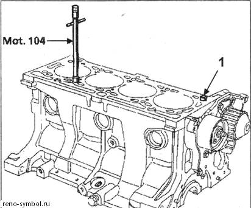
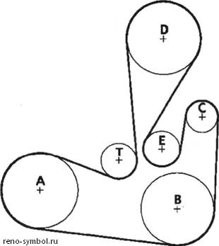
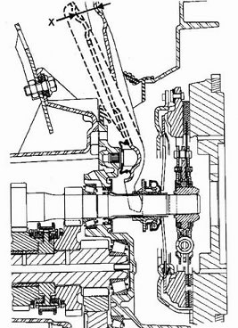
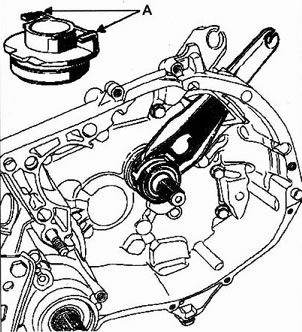
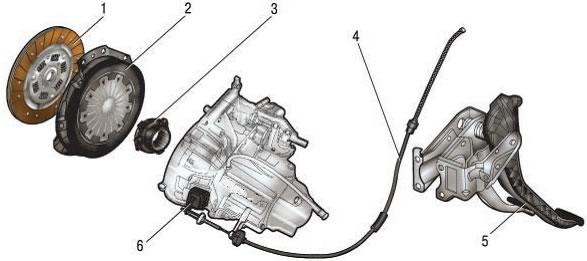

# 4.1 Сцепление

 

Сцепление передаёт крутящий момент от коленвала к первичному валу КПП и позволяет кратковременно отключать трансмиссию при переключении передач и остановках.

```mermaid
flowchart TD
    K[Коленвал] --> M[Маховик]
    M --> D[Ведомый диск<br/>фрикционные накладки]
    D --> KZ[Корзина нажимной диск<br/>с диафрагменной пружиной]
    KZ --> VP[Выжимной подшипник]
    VP --> PP[Первичный вал КПП]

    subgraph Привод
        P[Педаль] -->|Трос [I]| V[Вилка выключения]
        P -->|ГЦС [II/III]| RC[Рабочий цилиндр]
        RC --> V
    end

    V --> VP

    style M fill:#e65100,color:#fff
    style D fill:#1565c0,color:#fff
    style KZ fill:#2e7d32,color:#fff
```

```admonition info
На Symbol I (1999–2002) — тросовый привод. На Symbol II / Symbol III (2002–2014) — гидравлический. Взаимозаменяемость узлов сцепления между поколениями — ограниченная (разные маховики и корзины).
```

## Конструкция

- **Тип:** однодисковое, сухое, с диафрагменной пружиной
- **Корзина (нажимной диск):** стальная штампованная, с диафрагменным лепестковым пружинным кольцом
- **Ведомый диск:** с фрикционными накладками (безасбестовые) и демпферными пружинами в ступице для гашения крутильных колебаний
- **Маховик:** чугунный, плоскость прилегания диска без термической обработки (замена при рисках >0,3 мм)

## Привод сцепления

### Тросовый **[Symbol I (1999–2002)]**
- Педаль соединена с вилкой выключения стальным тросом в пластиковой оплётке
- Регулировка: резьбовой наконечник на вилке КПП
- **Ход педали:** 135–145 мм (свободный ход 5–10 мм)

### Гидравлический **[Symbol II / Symbol III (2002–2014)]**
- Главный цилиндр сцепления (ГЦС) на педальном узле → трубка → рабочий цилиндр (расположен на картере КПП)
- Выжимной подшипник объединён с рабочим цилиндром (центрального выключения)
- Прокачка: стандартная, как тормозная система (DOT-4)

## Диагностика неисправностей

| Симптом | Вероятная причина | Устранение |
|---------|-------------------|------------|
| Сцепление «буксует» (обороты растут, скорость не растёт) | Износ накладок, ослабление диафрагменной пружины | Замена диска и корзины |
| Сцепление «ведёт» (передачи включаются с хрустом) | Неполное выключение, завоздушивание гидропривода | Прокачка / осмотр троса |
| Рывки при трогании | Замасливание диска, деформация корзины | Замена, устранить течь масла |
| Стук при нажатии педали | Износ выжимного подшипника | Замена в сборе с корзиной |
| Свист/шум в районе КПП на нейтрали | Износ первичного вала или подшипника | Разбор КПП |
| Вибрация педали | Деформация диска, неравномерный износ маховика | Замена диска, шлифовка/замена маховика |

## Замена сцепления

> ⚠ Работы выполнять на подъёмнике или эстакаде. Перед началом обязательно обесточить АКБ (отключить минусовую клемму).

### Необходимые инструменты
- Головка Torx Tx55 (болты корзины)
- Динамометрический ключ (20–60 Н·м)
- Съёмник для центровки диска (оправка)
- Подставки под КПП и двигатель

### Порядок работ
1. Отсоединить АКБ, снять воздушный фильтр и корпус
2. Снять стартер (доступ к болтам крепления КПП к двигателю)
3. Отсоединить привод сцепления (трос или гидравлика)
4. Снять приводные валы из КПП (см. раздел 4.3)
5. Открутить нижнюю шаровую опору и отвести поворотный кулак в сторону
6. Поддомкратить КПП, открутить опоры и заднюю опору силового агрегата
7. Открутить болты крепления КПП к блоку (8 шт Torx Tx55)
8. Извлечь КПП в сборе
9. Снять корзину (равномерно отворачивая болты, снимая усилие пружины)
10. Снять ведомый диск и проверить маховик
11. Заменить выжимной подшипник
12. Установить новый диск (центровка оправкой), корзину (момент затяжки 20 Н·м)
13. Собрать в обратной последовательности

### Моменты затяжки

| Соединение | Момент, Н·м |
|------------|-------------|
| Болты корзины к маховику | 20 |
| Болты КПП к двигателю | 50 |
| Гайка ступицы | 200 |
| Опоры КПП | 45 |
| Стартер | 25 |

## Регулировка тросового привода

1. На резьбовом наконечнике у вилки КПП ослабить контргайку
2. Вращением наконечника добиться свободного хода вилки 5–7 мм
3. Затянуть контргайку
4. Проверить: педаль должна иметь свободный ход 5–10 мм до начала сопротивления

## Продольные и поперечные стуки

- **Скрип педали** — смазка оси педали (WD-40 или литиевая смазка)
- **Вибрация на 2000–3000 об/мин** — ослабление демпферных пружин диска (требуется замена)
- **Стук при резком газе** — люфт шлицевого соединения диска с первичным валом (замена диска)

## Ресурс и замена

Типичный ресурс сцепления Symbol — 80 000–120 000 км в смешанном цикле. При агрессивной езде с частыми стартами и пробками — от 50 000 км. Рекомендуется всегда заменять комплектом: корзина + диск + выжимной подшипник. Замена одного компонента недопустима из-за неравномерной приработки.

## Фото

*Элементы привода сцепления*




