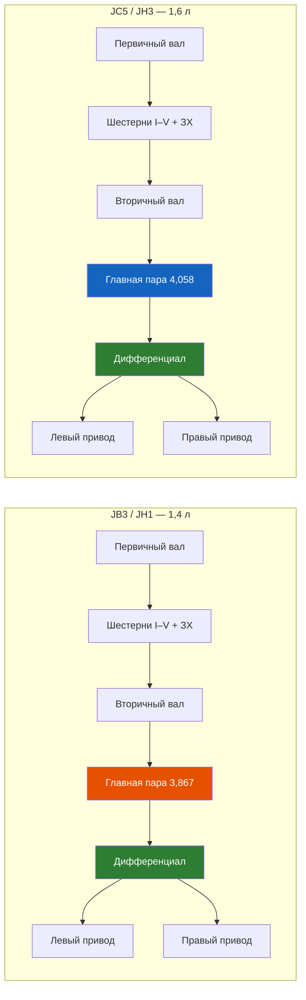
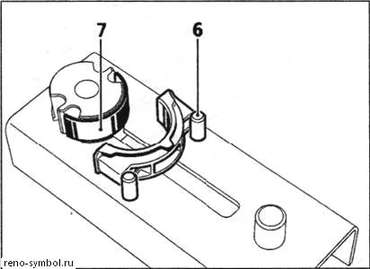
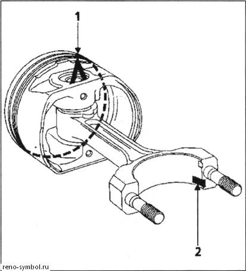

# 4.2 Коробка передач (МКПП)

На Renault Symbol устанавливаются 5-ступенчатые механические коробки передач серий JB3 (двигатель K7J 1,4 л) и JC5 (двигатель K7M 1,6 л). Обе — двухвальные, с дифференциалом в общем картере.

 

## Технические характеристики

| Параметр | JB3 (JR5) | JC5 (JH3) |
|----------|-----------|-----------|
| Двигатели | K7J 1,4 л | K7M 1,6 л |
| Материал картера | Алюминий | Алюминий |
| Сухая масса, кг | ~38 | ~40 |
| Количество передач | 5 + задняя | 5 + задняя |
| Синхронизаторы | Все передачи | Все передачи |
| Тип привода | Тросовый (кулиса) | Тросовый (кулиса) |
| Reverse lockout | Есть (электромагнитный) | Есть (электромагнитный) |

## Передаточные числа

| Передача | JB3 (1,4 л) | JC5 (1,6 л) |
|----------|-------------|-------------|
| I | 3,727 | 3,727 |
| II | 2,048 | 2,048 |
| III | 1,321 | 1,321 |
| IV | 0,976 | 0,976 |
| V | 0,757 | 0,757 |
| Задний ход | 3,545 | 3,545 |
| Главная передача | 3,867 | 4,058 |

Передаточные числа III–V одинаковы на обеих коробках. Различие в главной паре: JB3 — 3,867 (14×54 зуба), JC5 — 4,058 (14×57 или 15×61).

## Устройство

- **Первичный вал:** выполнено заодно с шестернями I–V и заднего хода
- **Вторичный вал:** шестерни свободно вращаются на игольчатых подшипниках, фиксируются синхронизаторами
- **Дифференциал:** конический, двухсателлитный
- **Картер:** разъёмный (две половины — со стороны маховика и крышка)
- **Механизм выбора:** тросовая кулиса с дистанционным управлением

## Масло в КПП

### Спецификация
- **Масло:** 75W-80 GL-4 (или 75W-90 GL-4)
- **Объём:** 2,2 л (JB3), 2,5 л (JC5)
- **Заводская заливка:** Elf Tranself NF 75W-80
- **Аналоги:** Motul Gear 300 75W-80, Castrol Syntrans 75W-80, Total Transmission SYN FE 75W-80

### Проверка уровня
1. Установить автомобиль на ровную площадку
2. Открутить контрольную пробку (на картере со стороны левого привода, ключ-шестигранник 8 мм)
3. Масло должно быть на уровне нижней кромки отверстия
4. Доливка — через контрольное отверстие шприцем до вытекания

> ⚠ Заливать масло через сапун или щуп нельзя — это приводит к переливу и выдавливанию сальников.

### Замена масла
1. Прогреть КПП (10–15 мин езды)
2. Снять защиту картера (если есть)
3. Открутить сливную пробку (шестигранник 10 мм), слить масло в ёмкость
4. Закрутить сливную пробку (момент 25 Н·м)
5. Открутить контрольную пробку
6. Через контрольное отверстие залить свежее масло шприцем-наливкой до вытекания
7. Закрутить контрольную пробку (момент 25 Н·м)

Периодичность замены: каждые 60 000 км или раз в 3 года. При тяжёлых условиях (частые пробки, буксировка) — 40 000 км.

## Reverse lockout (блокировка включения задней передачи)

Электромагнитный соленоид на механизме выбора передач предотвращает случайное включение заднего хода при движении вперёд. Соленоид замыкает цепь на массу и блокирует рычаг, пока не получен сигнал от ЭБУ (скорость <5 км/ч).

### Неисправности reverse lockout
- **Задняя передача не включается:** проверить предохранитель F7 (15A), соленоид, проводку
- **Индикатор заднего хода не горит:** датчик включения ЗХ на КПП (заменить)
- **Задняя включается на ходу:** заклинивание соленоида в открытом положении (замена)

## Типовые неисправности

| Неисправность | Причина | Ремонт |
|--------------|---------|--------|
| Шум на I–II при разгоне | Износ подшипников первичного/вторичного вала | Дефектовка, замена подшипников |
| Вылетает V передача | Износ вилки/сухарей синхронизатора V | Замена вилки и синхронизатора |
| Трудное включение всех передач | Низкий уровень масла, износ кулисы | Проверить масло, заменить тросы/втулки |
| Стук при трогании | Износ шлицев дифференциала | Замена дифференциала (дорого) |
| Течь масла по приводам | Износ сальников полуосей | Замена сальников (левого 28×47×10, правого 32×52×10) |
| Гул на скорости | Износ подшипника дифференциала | Разбор КПП, замена |

## Ремонт кулисы

Ослабление фиксации кулисы — частая проблема на Symbol с пробегом >100 000 км.

1. Снять декоративную накладку рычага КПП
2. Подтянуть болт фиксации кулисы (ключ Torx T30, момент 8 Н·м)
3. Проверить состояние резиновых втулок тяг
4. При износе втулок — заменить (артикул Renault 7700430577)

## Продление ресурса

- Замена масла каждые 60 000 км (даже если в сервисной книжке указано «необслуживаемая»)
- Прогрев КПП зимой перед интенсивной ездой
- Плавное включение I и II передачи до полной остановки синхронизаторов

> ⚠ При появлении гула или шелеста на любой передаче — немедленно проверить уровень масла. Эксплуатация с низким уровнем приводит к задирам шестерён и замене КПП в сборе.
