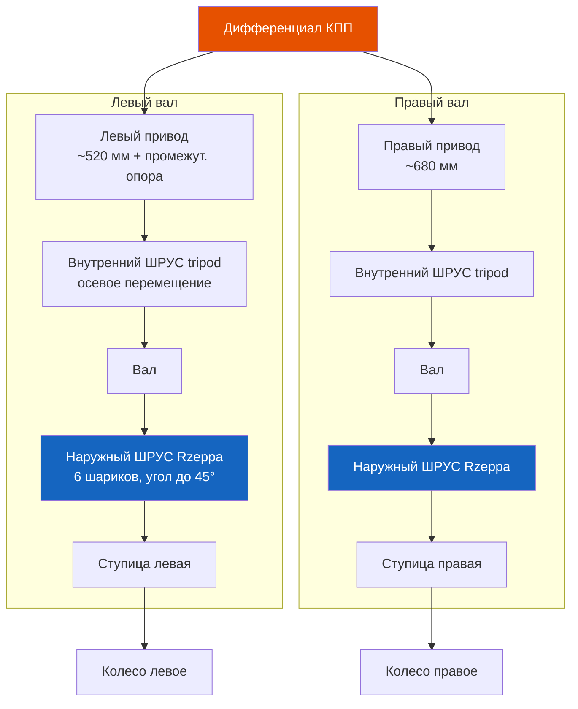

# 4.3 Приводные валы и ступицы

Приводные валы (полуоси) передают крутящий момент от дифференциала КПП к ступицам передних колёс. Каждый вал состоит из двух шарниров равных угловых скоростей (ШРУС) — внутреннего (со стороны КПП) и наружного (со стороны колеса).

## Конструкция переднего привода

### Внутренний ШРУС (триподный)
- **Тип:** Tripod (трёхшиповый)
- **Корпус:** стальной, с тремя беговыми дорожками
- **Трипод:** три сферических ролика на игольчатых подшипниках
- **Особенность:** допускает осевое перемещение (компенсация хода подвески и изменение длины вала при повороте)

### Наружный ШРУС (шариковый)
- **Тип:** Rzeppa (шариковый шестишариковый)
- **Корпус:** стальной, с канавками для шариков
- **Сепаратор + 6 шариков**
- **Особенность:** угол поворота до 45°, осевое перемещение не допускается

### Промежуточная опора
- С левой стороны (со стороны водителя) вал имеет промежуточную опору — подшипник качения, закреплённый на блоке цилиндров двигателя
- При замене сальника КПП слева — снимать промежуточную опору обязательно

## Технические характеристики

| Параметр | Значение |
|----------|----------|
| Длина левого вала | ~520 мм (с промежуточной опорой) |
| Длина правого вала | ~680 мм |
| Количество шлицов (ступица) | 22 |
| Количество шлицов (дифференциал) | 24 |
| Наружный ШРУС (артикул) | Renault 7701347997 / GKN 305097 |
| Внутренний ШРУС (артикул) | Renault 7701204364 / GKN 303009 |
| Пыльник внутр. ШРУС (артикул) | Renault 7701349307 |
| Пыльник наружн. ШРУС (артикул) | Renault 7701349306 |

## Диагностика неисправностей

| Симптом | Причина |
|---------|---------|
| Хруст при повороте (на месте или на малой скорости) | Износ наружного ШРУСа |
| Хруст при разгоне по прямой | Износ внутреннего ШРУСа |
| Вибрация при разгоне | Износ трипода, деформация вала |
| Гул на скорости >60 км/ч | Износ ступичного подшипника |
| Пятна масла на внутренней стороне колеса | Разрыв пыльника ШРУСа, вытекание смазки |

> ⚠ При обнаружении разрыва пыльника — замена в течение 1–2 дней. Попадание абразива в шарнир разрушает его за 500–1000 км.

## Замена пыльника ШРУСа

### Инструменты
- Съёмник стопорного кольца
- Цанговый зажим / съёмник ШРУСа
- Молоток, съёмник для снятия хомутов пыльника
- Новая смазка ШРУС (Molykote G-2000 или аналог)

### Порядок работ (наружный ШРУС)
1. Снять колесо, открутить гайку ступицы (200 Н·м, с воротком)
2. Отсоединить шаровую опору от поворотного кулака
3. Выпрессовать полуось из ступицы (лёгкими ударами молотка через выколотку)
4. Извлечь полуось из КПП (поддеть монтажкой)
5. Снять хомуты пыльника, сдвинуть пыльник по валу
6. Спрессовать ШРУС с вала съёмником
7. Промыть шарнир в керосине, просушить
8. Заложить новую смазку (70% в корпус, 30% на трипод/обойму)
9. Надеть новый пыльник, затянуть хомуты (специальными клещами)
10. Установить ШРУС до щелчка стопорного кольца
11. Собрать в обратной последовательности

> ⚠ Не заменять смазку ШРУСа на графитную или литиевую — используется только специализированная смазка с дисульфидом молибдена (MoS₂).

## Гайка ступицы

| Параметр | Значение |
|----------|----------|
| Момент затяжки | 200 Н·м |
| Тип гайки | Самостопорящаяся (деформируемая) |
| Замена при отворачивании | Обязательно новая |
| Посадка | Шлицы M22 × 1,5 |
| Контровка | Нет (самоконтрящаяся) |

### Процедура затяжки
1. Наживить новую гайку на шлицевый хвостовик до упора в ступицу
2. Затянуть динамометрическим ключом до 200 Н·м
3. Довернуть, если паз гайки не совпадает со стопорным отверстием (допускается доворот до 60°)

> ⚠ Использование старой гайки недопустимо — она теряет стопорящие свойства и может самоотвернуться.

## Замена приводного вала в сборе

1. Зафиксировать руль в нейтральном положении
2. Снять колесо и открутить гайку ступицы
3. Отсоединить рулевую тягу (открутить гайку, выпрессовать палец)
4. Отсоединить шаровую опору (2 болта к кулаку)
5. Извлечь вал из ступицы (монтажкой между рычагом и кулаком)
6. Извлечь вал из КПП (аккуратно поддеть пластиковым клином)
7. Установить новый вал до щелчка стопорного кольца в дифференциале
8. Собрать в обратном порядке

> ⚠ При установке вала в КПП не ударять по хвостовику — повредится стопорное кольцо внутри дифференциала. Запрессовывать вал только до щелчка рукой.

## Ступичные подшипники

- **Тип:** двухрядный шариковый, закрытый (необслуживаемый)
- **Артикул:** SKF VKBA 3587 / FAG 713607170 / SNR R173.10
- **Замена:** прессом под 30 тонн (запрессовка в кулак + напрессовка на ступицу)
- **Момент затяжки гайки ступицы:** 200 Н·м
- **Признак износа:** гул на повороте, люфт при покачивании колеса

> ⚠ После замены ступичного подшипника обязательна протяжка через 50–100 км пробега.
