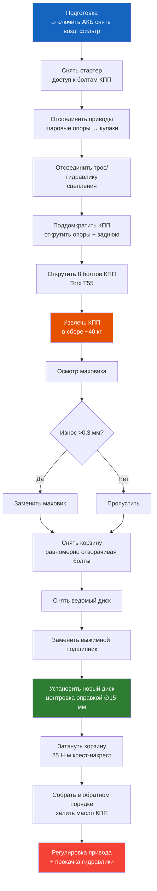

# 4.4 Замена сцепления

Пошаговая инструкция по замене сцепления на Renault Symbol (K7J, K7M, K4J, K4M). Операция требует снятия коробки передач, рекомендуется выполнять на подъёмнике или смотровой яме.

> **Регламент:** Замена сцепления — каждые 150 000–200 000 км или при появлении признаков износа. При замене обязательно меняется **весь комплект** (корзина, диск, выжимной подшипник).

## Признаки износа сцепления

| Симптом | Вероятная причина |
|---------|-------------------|
| Педаль стала мягче/выше | Износ фрикционных накладок |
| Пробуксовка (обороты растут, скорость нет) | Износ диска / ослабление пружины корзины |
| Рывки при трогании | Масло на диске / деформация корзины |
| Стук при нажатии педали | Износ выжимного подшипника |
| Затруднённое включение передач, хруст | Неполное выключение (ведёт диск / воздух в гидроприводе) |
| Скрежет в районе КПП | Разрушение подшипника первичного вала |

## Необходимые инструменты

| Инструмент | Назначение |
|------------|------------|
| Головка на 10, 13, 16, 18, 21 мм | Основные крепления |
| Трещотка + удлинители | Доступ к болтам |
| Торцевая головка E14 (Torx) | Болты крепления КПП к двигателю |
| Отвёртка плоская монтажная | Поддевание, центровка |
| Съёмник ШРУСов (2-захватный) | Для выпрессовки приводов |
| Центрирующий вал / оправка для диска сцепления | Центровка диска (∅15 мм) |
| Домкрат гидравлический 2 т | Поддержка КПП |
| Фиксатор маховика | Стопорение маховика при откручивании |
| Ёмкость для слива масла КПП | ~2 литра |

## Порядок замены

### 1. Подготовка
1. Отсоедините клемму «–» АКБ.
2. Снимите воздушный фильтр и корпус.
3. Слейте масло из КПП (сливная пробка слева, под приводом).
4. Снимите стартер (головка на 13, 2 болта).

### 2. Снятие приводов
1. Открутите ступичную гайку (головка на 30, усилие предварительно ослабить на земле).
2. Выньте шплинт рулевого наконечника, открутите гайку (16 мм), выпрессуйте наконечник съёмником.
3. Открутите нижний шаровой шарнир (18 мм).
4. Выпрессуйте ШРУС из ступицы молотком с выколоткой.
5. Извлеките внутренний ШРУС из КПП монтажкой.

### 3. Отсоединение КПП
1. Отсоедините трос сцепления (на КПП, со стороны двигателя).
2. Отсоедините разъём выключателя заднего хода.
3. Открутите верхние болты крепления КПП к двигателю (E14, доступ сверху).
4. @Открутите нижние болты (головка на 16, доступ снизу).
5. Подставьте домкрат под поддон КПП (с деревянной прокладкой).
6. Открутите подушку КПП (головка на 18, 2 болта с каждой стороны).
7. Снимите КПП, сдвинув её в сторону двигателя и опуская вниз. **Вес КПП ~35 кг** — работайте с напарником.

### 4. Демонтаж старого сцепления
1. Зафиксируйте маховик фиксатором.
2. Открутите 6 болтов корзины (головка на 10, крест-накрест, в 2–3 приёма).
3. Снимите корзину и диск.
4. Снимите выжимной подшипник (снимается с направляющей втулки).

### 5. Дефектовка

| Деталь | Критерий замены |
|--------|-----------------|
| Ведомый диск | Остаток накладок <1,5 мм до заклёпок / масло / трещины |
| Корзина | Износ лепестков диафрагмы >0,5 мм / подгорание |
| Выжимной подшипник | Люфт / шум при вращении |
| Маховик | Риски >0,3 мм / биение >0,1 мм / трещины |
| Направляющая втулка | Износ / задиры |

### 6. Установка нового сцепления
1. **Очистите** маховик и привалочную плоскость от грязи и масла (обезжиривателем).
2. **Установите** новый ведомый диск на оправку.
3. **Установите** новую корзину, закрутите болты **крест-накрест** моментом **25 Н·м**.
4. **Извлеките** центрирующую оправку.
5. **Установите** новый выжимной подшипник (смазав направляющую тонким слоем смазки).

### 7. Сборка — обратная последовательность
1. Установите КПП на место, затяните болты моментом **45 Н·м**.
2. Подсоедините приводы, затяните ступичную гайку моментом **180–200 Н·м**.
3. Залейте масло в КПП: **1,9–2,1 л** (см. характеристики).
4. Подсоедините трос сцепления, отрегулируйте зазор.

### 8. Регулировка привода сцепления
1. Нажмите педаль до упора 3–5 раз.
2. Зазор между толкателем и вилкой: **2–3 мм**.
3. Свободный ход педали: **8–12 мм**.
4. Проверьте: передачи включаются без хруста, сцепление схватывает в середине хода педали.

### 9. Обкатка
- Первые **500 км**: избегайте резких стартов, буксировки, движения на высоких передачах внатяг.
- При появлении запаха гари в первые дни — нормально (притирка диска).

## Моменты затяжки

| Соединение | Момент, Н·м | Примечание |
|------------|-------------|------------|
| Болты корзины к маховику | 25 | Крест-накрест, 2 прохода |
| Болты КПП к двигателю | 45 | M12, класс 8.8 |
| Ступичная гайка привода | 180–200 | Новая гайка, затяжка на земле |
| Болты стартера | 35 | — |
| Шаровая опора | 40–45 | — |
| Наконечник рулевой тяги | 30–35 | — |
| Маслосливная пробка КПП | 25 | Новая шайба |

## Какие запчасти купить

| Деталь | Оригинал | Аналог (рекомендовано) |
|--------|----------|------------------------|
| Комплект сцепления (корзина + диск + выжимной) | 30205 44863R | **Valeo** 826 327 / **Luk** 624 3276 / **Sachs** 3000 510 065 |
| Выжимной подшипник (отдельно) | 30205 45307R | SKF VKC 6634 / SNR MD4X007 |
| Центрирующая оправка | — | ∅15 мм (универсальная) |
| Масло КПП | Elf Tranself NFJ 75W-80 | 1,9–2,1 л |
| Шплинт рулевой тяги | 77031 00023 | Универсальный |

## Трудоёмкость

| Операция | Время (нормо-часы) |
|----------|-------------------|
| Замена сцепления (полная) | 4,5–6,0 ч |
| Со снятием/установкой КПП | 3,0–4,0 ч |
| Замена выжимного подшипника (без снятия КПП) | 1,5 ч |

> С работой без опыта — закладывайте **8–10 часов** и обязательно напарника для снятия коробки.
