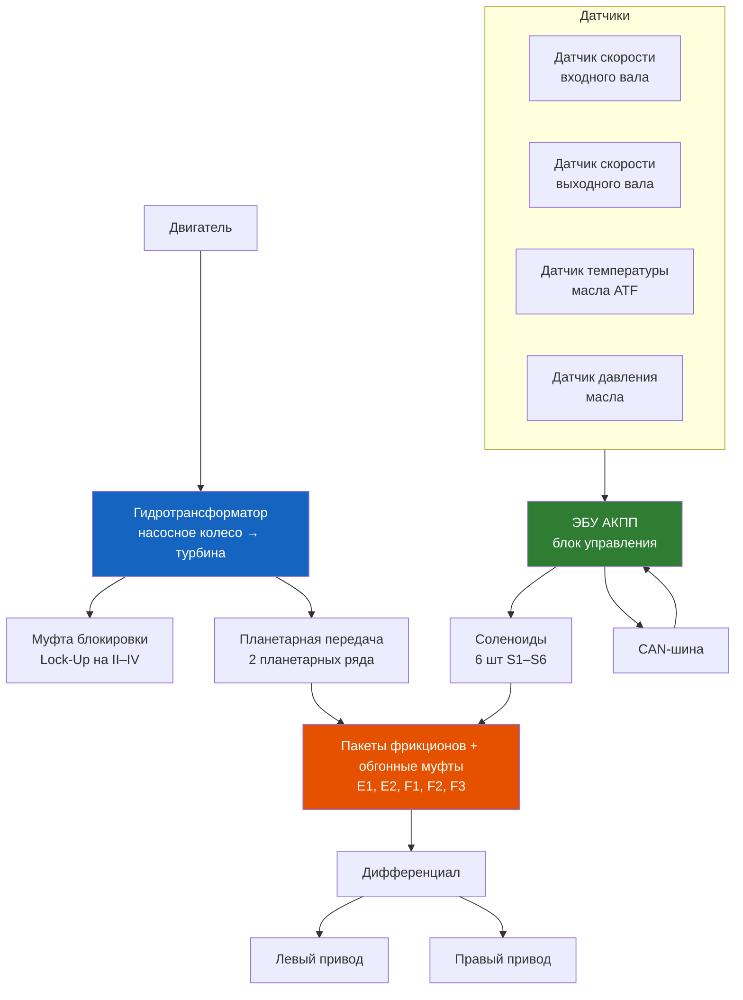

# 4.5 Автоматическая коробка передач DP0 (AL4)

На Renault Symbol с двигателями K4J (1.4 16V) и K4M (1.6 16V) опционально устанавливалась 4-ступенчатая автоматическая коробка передач DP0 (также известна как AL4). Это гидромеханическая АКПП с блокировкой гидротрансформатора и адаптивным управлением от ЭБУ.

> **[Symbol II (2002–2008)]** — DP0 на двигателях K4J / K4M
> **[Symbol III (2008–2014)]** — DP0 на двигателе K4M

## Технические характеристики

| Параметр | Значение |
|----------|----------|
| Тип | Гидромеханическая, 4-ступенчатая |
| Производитель | Renault / Peugeot / Citroën (совместная разработка) |
| Индекс | DP0 / AL4 |
| Масса (сухая) | ~70 кг |
| Гидротрансформатор | С блокировкой (Lock-Up) на II–IV передачах |
| Масло | ELF Renaultmatic D3 Syn / Mobil ATF LT 71141 |
| Объём масла (полная заправка) | 6,0 л |
| Объём масла (замена частичная) | 3,0–3,5 л |
| Интервал замены масла | Каждые 30 000–60 000 км (рекомендуется 30 000) |
| Управление | ЭБУ Aisin Warner, CAN/Siemens |
| Режимы работы | Автоматический / Ручной (на некоторых версиях) |



## Передаточные числа

| Передача | Передаточное число |
|----------|-------------------|
| I | 2,740 |
| II | 1,500 |
| III | 1,000 |
| IV | 0,710 |
| Задний ход | −2,450 |
| Главная передача | 3,590 |

## Масло в АКПП DP0

### Тип и спецификация

- **Оригинальное:** ELF Renaultmatic D3 Syn (артикул Renault 7711770844)
- **Совместимые:** Mobil ATF LT 71141 (спецификация LT 71141 обязательно!)
- **Объём:** 6,0 л (полная заправка), 3,0–3,5 л (частичная замена сливом)
- **Цвет:** Красный (новое) → коричневый (эксплуатация) → чёрный/горелый (критический)

```admonition danger
DP0 критична к типу масла. Использование Dexron III, Mercon V или других ATF **запрещено** — разрушение уплотнений и фрикционов в течение 5 000–10 000 км. Только LT 71141 или оригинал Renaultmatic D3 Syn.
```

### Проверка уровня

1. Прогрейте АКПП (20–30 км пробега или 15 мин на холостых)
2. Установите авто на ровную площадку
3. Не глушите двигатель, селектор в P
4. Извлеките щуп (оранжевый, расположен в моторном отсеке со стороны АКБ)
5. Уровень должен быть между метками HOT MIN и HOT MAX
6. Жидкость должна быть красноватой, без запаха гари

### Частичная замена масла (3,0–3,5 л)

```text
1. Прогрейте АКПП до рабочей температуры (60–80 °C)
2. Открутите сливную пробку (шестигранник 10 мм)
3. Слейте масло в мерную ёмкость — должно выйти ~3,0–3,5 л
4. Замерьте объём слитого — залейте столько же нового
5. Заливайте через щуп воронкой с длинным носиком
6. Запустите двигатель, прогрейте АКПП
7. Проверьте уровень при работающем двигателе
```

### Полная замена (аппаратная)

Для удаления старого масла из гидротрансформатора необходима **замена на стенде** (промывочная установка типа ATF-Tronic или аналог). В домашних условиях полная замена циркуляционным методом:
1. Отсоедините обратную магистраль радиатора охлаждения ATF
2. Запустите двигатель — насос АКПП выкачает старое масло
3. Одновременно заливайте новое масло в щуп
4. Остановитесь, когда из обратки пойдёт чистое красное масло

## Типовые неисправности DP0

### Симптомы и решение

| Симптом | Код ошибки | Причина | Ремонт |
|---------|-----------|---------|--------|
| Рывки при переключении I↔II | P0740 / P0745 | Износ фрикционов E1, загрязнение гидроблока | Замена масла, промывка гидроблока |
| Пробуксовка на II передаче | P0732 | Износ фрикциона E2 | Замена фрикционов (капремонт) |
| Нет заднего хода | P0750 | Износ обгонной муфты F2 | Разбор АКПП, замена |
| Гидротрансформатор не блокируется | P0740 | Клапан Lock-Up, износ накладок | Замена гидротрансформатора |
| Долгое включение передачи | P0753 | Соленоид S1 — загрязнение/обрыв | Промывка/замена |
| Аварийный режим (только III) | — | Показания датчиков вне диапазона | Диагностика соленоидов и датчиков |
| Масло вытекает по щупу | — | Перелив масла, засор сапуна | Проверить уровень, прочистить сапун |
| Стук при переключении с P на R | — | Износ крестовины кардана (редко) | Проверка приводов |

```admonition warning
При появлении аварийного режима (горит лампочка SPORT + моргает * на панели) — немедленно прекратите движение. В большинстве случаев достаточно заменить масло и промыть гидроблок, но дальнейшая эксплуатация на грязном масле разрушает фрикционы.
```

### Сброс адаптации АКПП

После замены масла или ремонта необходимо сбросить адаптации ЭБУ АКПП:

**Метод 1 — через сканер:**
1. Подключите Can Clip / ELM327 с поддержкой Renault
2. Выберите блок АКПП (Automatic Transmission)
3. Меню «Сброс адаптации» / «Reset Adaptive Values»
4. Подтвердите, выключите зажигание на 30 секунд

**Метод 2 — без сканера (ручной сброс):**
1. Прогрейте АКПП (15–20 км езды)
2. Остановитесь на ровной площадке, двигатель работает
3. Переведите селектор в P, выключите зажигание
4. Включите зажигание, удерживайте педаль тормоза
5. Переведите селектор: P → R → N → D → 3 → 2 → 1 (задерживаясь 5 секунд на каждой)
6. Вернитесь в P, выключите зажигание
7. Запустите — АКПП начнёт цикл адаптации (первые 50 км работа может быть неидеальной)

## Обслуживание и продление ресурса

### Что убивает DP0 быстрее всего

1. **Грязное масло** — 90% проблем DP0 решаются заменой масла раз в 30 000 км. Жидкость ATF работает при 80–100 °C, окисляется и теряет свойства
2. **Буксы на месте** — «газ в пол» с места нагружает гидротрансформатор. Прогревайте масло (1–2 мин на P) перед началом движения
3. **Непрогретая АКПП зимой** — на холодном масле соленоиды работают плохо. Первые 5–10 мин двигайтесь без резких ускорений
4. **Неправильный тип масла** — ATF не той спецификации разрушает тефлоновые кольца и уплотнения

### Регламент обслуживания

| Операция | Периодичность |
|----------|---------------|
| Частичная замена масла | 30 000 км / 2 года |
| Полная замена масла (аппаратная) | 60 000 км / 4 года |
| Замена фильтра АКПП (в поддоне) | 60 000 км |
| Сброс адаптаций | После замены масла |
| Проверка уровня | Каждые 15 000 км |

## Отличия АКПП от МКПП в эксплуатации

| Аспект | АКПП DP0 | МКПП JB3/JC5 |
|--------|----------|---------------|
| Масло | 6 л ATF LT 71141 | 2,2–2,5 л 75W-80 GL-4 |
| Масса | ~70 кг | ~40 кг |
| Ресурс до капремонта | 200 000–300 000 км | 300 000+ км |
| Замена масла частая? | Да, каждые 30 000 км | Нет, каждые 60 000 км |
| Движение на нейтрали | **Запрещено** | Допустимо (накат) |
| Буксировка | Нейтраль N, до 50 км, не более 50 км/ч | Нейтраль без ограничений |
| Пуск с толкача | **Невозможно** (нужен насос ATF) | Возможно |

```admonition info
Буксировка автомобиля с АКПП DP0: трос только при работающем двигателе или с поднятыми передними колёсами. Если двигатель не заводится — вызывайте эвакуатор с полной погрузкой. Буксировка с неработающим двигателем убивает АКПП за 5–10 км (нет смазки гидротрансформатора).
```

## Аварийный режим

При обнаружении неисправности ЭБУ переводит АКПП в **аварийный режим** (Limp Mode):
- Включается только III передача
- Селектор в режиме D — движение только на III
- Переключение в 1, 2, R возможно
- Индикация: лампа SPORT и * моргают на панели приборов

**Что делать:**
1. Остановитесь, заглушите двигатель на 1–2 минуты
2. Запустите — если индикация погасла, ошибка была временной (перегрев, низкое напряжение)
3. Если горит постоянно — необходима диагностика
4. До сервиса можно доехать на III передаче, **но не более 30–50 км** — износ фрикционов
