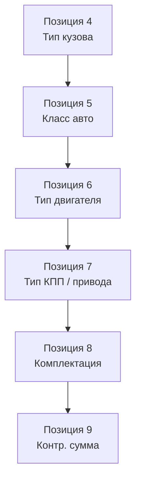

# Расшифровка VIN-номера

VIN (Vehicle Identification Number) — 17-значный идентификационный номер автомобиля. Для Renault Symbol содержит информацию о заводе-изготовителе, модели, типе двигателя, кузова и годе выпуска.

## Структура VIN Renault Symbol

VIN-номер Renault Symbol имеет формат **WF1 — 4 знака производителя + 6 знаков описание + 8 знаков идентификация**.

```text
VF1  XXXXXXX  X  X  XXXXXX
├──┘ ├──────┘ ├──┘  ├────┘
│    │        │     └── Заводской номер (6 знаков)
│    │        └──────── Контрольная сумма (1 знак)
│    └───────────────── Модель + двигатель + тип кузова (6 знаков: C0, C1, C2, C3, C4, C5)
└────────────────────── Производитель (WMI — World Manufacturer Identifier)
```

## WMI — производитель

| Код | Производитель | Страна |
|-----|--------------|--------|
| **VF1** | Renault | Франция |
| **VSS** | SEAT | Испания (не Symbol) |
| **8A1** | Renault | Испания (Renault Spain) |

Symbol поставлялся в Россию с заводов: **VF1** — Франция (Flins, Palencia), **8A1** — Испания (Palencia, Valladolid).

## Позиции с VF1 (Renault France)

### VDS — описание автомобиля (позиции 4–9)



### Позиция 4 — Тип кузова

| Символ | Кузов |
|--------|-------|
| **B** | Седан (Symbol) |
| **C** | Седан (Symbol) |
| **K** | Хэтчбек (Clio) |
| **S** | Универсал / Van |
| **E** | Купе |

Для Symbol: **B** или **C**.

### Позиция 5 — Класс автомобиля

| Символ | Класс |
|--------|-------|
| **C** | Средний малый сегмент (Clio/Symbol) |

### Позиция 6 — Тип двигателя

| Символ | Двигатель | Объём | Мощность | Поколение |
|--------|-----------|-------|----------|-----------|
| **B** | K7J | 1,4 л | 55 кВт (75 л.с.) | Symbol I–III |
| **H** | K7M | 1,6 л | 64 кВт (88 л.с.) | Symbol I–II |
| **M** | K4J | 1,4 л 16V | 72 кВт (98 л.с.) | Symbol II–III |
| **P** | K4M | 1,6 л 16V | 77 кВт (105 л.с.) | Symbol II–III |
| **J** | K9K | 1,5 л dCi | 48 кВт (65 л.с.) | Symbol II |
| **L** | K9K | 1,5 л dCi | 60 кВт (82 л.с.) | Symbol III |
| **T** | E7J | 1,4 л | 55 кВт (75 л.с.) | Symbol I |

### Позиция 7 — Тип привода и КПП

| Символ | Привод | КПП |
|--------|--------|-----|
| **0** | Передний привод | МКПП 5-ст |
| **1–3** | Передний привод | МКПП / АКПП |
| **4** | Передний привод | АКПП DP0 |
| **5–6** | Передний привод | МКПП с ГУР |

### Позиция 8 — Комплектация

| Символ | Комплектация |
|--------|-------------|
| **A** | Базовое оборудование (точка А, без кондиционера, без ABS) |
| **B** | Средняя комплектация (кондиционер, ABS) |
| **C** | Полная комплектация (климат, ABS, ESP, ЭСП, ЦЗ) |
| **F** | Expression / Authentique |
| **H** | Privilege |
| **M** | Sport / Dynamique |

### Позиция 9 — Контрольная цифра VIN

Рассчитывается по алгоритму NHTSA (FMVSS 115). Позволяет проверить корректность VIN-номера.

```text
Валидация VIN:
1. Все буквы → цифры (A=1, B=2, ..., Z=9, исключая I, O, Q)
2. Каждая позиция умножается на весовой коэффициент
3. Сумма делится на 11 — остаток = контрольная цифра (X=10)
```

### Позиция 10 — Год выпуска

| Символ | Год | | Символ | Год |
|--------|-----|---|--------|-----|
| **X** | 1999 | | **8** | 2008 |
| **Y** | 2000 | | **9** | 2009 |
| **1** | 2001 | | **A** | 2010 |
| **2** | 2002 | | **B** | 2011 |
| **3** | 2003 | | **C** | 2012 |
| **4** | 2004 | | **D** | 2013 |
| **5** | 2005 | | **E** | 2014 |
| **6** | 2006 | | **F** | 2015+ |
| **7** | 2007 | | | |

### Позиция 11 — Заводской код

| Символ | Завод |
|--------|-------|
| **F** | Flins (Франция) |
| **P** | Palencia (Испания) |
| **V** | Valladolid (Испания) |
| **N** | Novo Mesto (Словения) |
| **B** | Bursa (Турция) |

### Позиции 12–17 — Порядковый номер производства

Последние 6 знаков — уникальный номер автомобиля на заводе. Первый автомобиль 000001, последний зависит от объёма выпуска.

## Пример расшифровки

```text
VF1  C0  J  4  C  5  Y  F  123456
│    │   │  │  │  │  │  │  └─── Заводской номер 123456
│    │   │  │  │  │  │  └────── Завод: Palencia (Испания)
│    │   │  │  │  │  └───────── Год: 2000
│    │   │  │  │  └──────────── Контрольная сумма
│    │   │  │  └─────────────── Комплектация: полная
│    │   │  └────────────────── АКПП DP0
│    │   └───────────────────── Двигатель: K9K 1,5 dCi
│    └──────────────────────── Седан Symbol
└────────────────────────────── Renault
```

**Результат:** Renault Symbol II, 2000 г.в., K9K 1.5 dCi (65 л.с.), АКПП, полная комплектация, завод Palencia

```text
VF1  B  CB  P  0  A  5  F  654321
│    │   │  │  │  │  │  └─── 654321
│    │   │  │  │  │  └────── 2005
│    │   │  │  │  └───────── A (контрольная)
│    │   │  │  └──────────── A: базовая комплектация
│    │   │  └─────────────── 0: МКПП 5-ст
│    │   └────────────────── P: K4M 1.6 16V (105 л.с.)
│    └────────────────────── B + CB: Symbol
└─────────────────────────── Renault
```

**Результат:** Renault Symbol II, 2005 г.в., K4M 1.6 16V (105 л.с.), МКПП, базовая комплектация

## Как найти VIN на автомобиле

| Расположение | Описание |
|-------------|----------|
| **Под лобовым стеклом (слева внизу)** | Пластина VIN видна через стекло, со стороны водителя |
| **На блоке цилиндров (слева, под свечами)** | Выбит на площадке блока |
| **На стойке водительской двери** | Табличка с VIN + масса + допуски |
| **На крышке багажника (слева)** | Дублирующая табличка |
| **В талоне ПТС** | В документе VIN указан в строке «Идентификационный номер (VIN)» |

## Онлайн-проверка VIN

| Сервис | Что даёт |
|--------|----------|
| **renault-vin.ru** | Расшифровка комплектации по VIN Renault |
| **vinbook.ru** | Полные данные по VIN |
| **official Renault CLIP** | Полная диагностика ЭБУ по VIN |
| **avtocode.net** | История ДТП, пробег, залоги |

```admonition tip
Перед покупкой Symbol обязательно проверьте VIN через независимый сервис. Сверьте данные со свидетельством о регистрации. Совпадение VIN в ПТС, на кузове и под стеклом — обязательное условие легального автомобиля.
```
